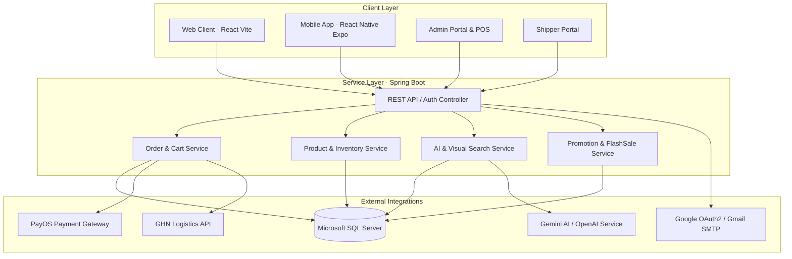

# 👟 ShoeStore - Hệ Thống Quản Lý & Bán Hàng Giày Dép Đa Nền Tảng


**ShoeStore** là một giải pháp thương mại điện tử toàn diện cho ngành bán lẻ giày dép, tích hợp đa nền tảng bao gồm **Backend RESTful API (Spring Boot)**, **Website Khách hàng & Hệ thống Admin/POS/Shipper (React + Vite)**, và **Ứng dụng Di động (React Native + Expo)**. System hỗ trợ thanh toán trực tuyến qua cổng PayOS, tính phí và tra cứu vận chuyển tự động qua Giao Hàng Nhanh (GHN), tích hợp AI tìm kiếm bằng hình ảnh và Trợ lý Chatbot thông minh.

---

## 📌 Mục Lục

1. [Sơ Đồ Kiến Trúc Hệ Thống](#-sơ-đồ-kiến-trúc-hệ-thống)
2. [Các Phân Hệ & Tính Năng Nổi Bật](#-các-phân-hệ--tính-năng-nổi-bật)
3. [Cấu Trúc Thư Mục Dự Án](#-cấu-trúc-thư-mục-dự-án)
4. [Công Nghệ Sử Dụng (Tech Stack)](#-công-nghệ-sử-dụng-tech-stack)
5. [Hướng Dẫn Cài Đặt & Khởi Chạy](#-hướng-dẫn-cài-đặt--khởi-chạy)
6. [Cấu Hình Biến Môi Trường](#-cấu-hình-biến-môi-trường)
7. [Tổng Quan REST API Endpoints](#-tổng-quan-rest-api-endpoints)
8. [Tác Giả & Giấy Phép](#-tác-giả--giấy-phép)

---

## 🏗️ Sơ Đồ Kiến Trúc Hệ Thống



---

## 🔥 Các Phân Hệ & Tính Năng Nổi Bật

### 🛒 1. Phân Hệ Khách Hàng (Website & Mobile App)
- **Trang chủ & Khám phá**: Banner động, bộ sưu tập Lookbook, danh mục sản phẩm nổi bật, sản phẩm bán chạy, sản phẩm mới về.
- **Tìm kiếm thông minh (Visual AI Search)**: Tải ảnh giày lên để AI phân tích và tìm kiếm sản phẩm tương tự trong cửa hàng.
- **Bộ lọc đa tiêu chí**: Lọc theo Thương hiệu, Danh mục, Kích cỡ (Size), Màu sắc (Color), Khoảng giá.
- **Chi tiết sản phẩm**: Chọn biến thể màu sắc & size, xem ảnh chi tiết, tồn kho từng loại, đánh giá & bình luận.
- **Giỏ hàng & Đặt hàng**: Thêm/Sửa/Xóa giỏ hàng, áp dụng Voucher giảm giá, tích hợp tính phí giao hàng GHN theo địa chỉ (Tỉnh/Thành, Quận/Huyện, Phường/Xã).
- **Thanh toán linh hoạt**:
  - Thanh toán COD (Nhận hàng trả tiền).
  - Thanh toán trực tuyến chuyển khoản QR Code qua cổng **PayOS**.
- **Quản lý Tài khoản & Hạng thành viên (Membership Ranks)**:
  - Đăng nhập/Đăng ký tài khoản, Đăng nhập nhanh với Google OAuth2, Quên/Đổi mật khẩu qua xác minh OTP Email.
  - Tích điểm nâng hạng thành viên (Đồng, Bạc, Vàng, Kim Cương) và nhận ưu đãi theo thứ hạng.
  - Theo dõi lịch sử đơn hàng và chi tiết hành trình vận chuyển.

---

### 💼 2. Phân Hệ Quản Trị (Admin Web Portal & POS)
- **Dashboard & Báo cáo thống kê**:
  - Biểu đồ doanh thu trực quan với **ApexCharts** (theo ngày, tháng, năm).
  - Thống kê sản phẩm bán chạy, danh mục xu hướng, đơn hàng mới.
  - Xuất báo cáo dữ liệu ra file **Excel (.xlsx)**.
- **Bán hàng tại quầy (POS - Point of Sale)**: Giao diện tạo đơn hàng trực tiếp tại cửa hàng dành cho nhân viên thu ngân.
- **Quản lý Sản phẩm & Biến thể**:
  - Quản lý danh mục, thương hiệu, size, màu sắc.
  - Quản lý danh sách sản phẩm, upload nhiều hình ảnh, thiết lập giá và số lượng tồn kho theo từng biến thể (Color x Size).
- **Quản lý Đơn hàng**: Duyệt đơn, cập nhật trạng thái (Chờ xác nhận, Đang xử lý, Đang giao, Đã giao, Hủy đơn), phân công đơn cho Shipper.
- **Chương trình Khuyến mãi & Flash Sale**:
  - Tạo đợt Flash Sale theo khung giờ đếm ngược (Countdown).
  - Tạo và quản lý Voucher giảm giá theo phần trăm hoặc số tiền cố định.
- **Quản lý Khách hàng & Hạng thẻ**: Xem thông tin khách hàng, lịch sử mua hàng, điều chỉnh điểm tích lũy / thứ hạng.
- **Live Chat / Hỗ trợ**: Tương tác trực tuyến với khách hàng qua hệ thống chat tích hợp.

---

### 🚚 3. Phân Hệ Giao Hàng (Shipper Workspace)
- Tra cứu danh sách đơn hàng được phân công giao.
- Cập nhật trạng thái giao hàng thực tế (Đang giao, Giao thành công, Giao thất bại kèm lý do).

---

### ⚡ 4. Phân Hệ Backend (Spring Boot Core Services)
- **Bảo mật & Phân quyền**: Spring Security, Google OAuth2 Client, mã hóa mật khẩu BCrypt.
- **Tự động hóa**: `AutoCompletingOrderRunner` tự động cập nhật trạng thái đơn hàng sau khoảng thời gian quy định.
- **Tích hợp Mail API**: Tự động gửi email xác thực OTP, xác nhận đơn hàng qua Gmail SMTP.

---

## 📁 Cấu Trúc Thư Mục Dự Án

```
duantotnghiep/
├── SHOESTORE/                  # [Backend] Spring Boot Application
│   ├── src/
│   │   ├── main/
│   │   │   ├── java/com/ShoeStore/
│   │   │   │   ├── config/          # Cấu hình Security, OAuth2, PayOS, Mail, WebMvc
│   │   │   │   ├── controller/      # Web MVC Controllers & Admin Managers
│   │   │   │   │   ├── admin/       # Admin Controllers (Dashboard, Products, Orders...)
│   │   │   │   │   ├── api/         # RESTful API Controllers (Auth, Product, Cart, PayOS...)
│   │   │   │   │   └── shipper/     # Shipper Controllers
│   │   │   │   ├── model/           # JPA Entities & DTOs (Product, Order, Customer, Voucher...)
│   │   │   │   ├── repository/      # Spring Data JPA Repositories
│   │   │   │   └── service/         # Business Logic Services
│   │   │   └── resources/
│   │   │       ├── application.properties  # File cấu hình Backend chính
│   │   │       ├── static/          # Static assets & Uploaded images
│   │   │       └── templates/       # Thymeleaf HTML Templates
│   └── pom.xml                  # Maven Dependencies Management
│
├── shoestore-web/               # [Frontend Web] React + Vite App
│   ├── src/
│   │   ├── components/          # Reusable UI Components (Navbar, Footer, Modal...)
│   │   ├── pages/               # Web Pages
│   │   │   ├── admin/           # Admin Portal Components & POS
│   │   │   ├── shipper/         # Shipper Portal Pages
│   │   │   └── ...              # Client Store Pages (Home, Shop, Cart, Checkout...)
│   │   ├── services/            # Axios API Clients
│   │   ├── App.jsx              # Main App Component & Client Routes
│   │   └── index.css            # Global Styles & Custom CSS
│   ├── package.json             # NPM Dependencies
│   └── vite.config.js           # Vite Configuration
│
└── shoestore-mobile/            # [Mobile App] React Native + Expo App
    ├── src/
    │   ├── components/          # Native Mobile Components
    │   ├── context/             # React Context (Auth, Cart, Theme)
    │   ├── screens/             # Mobile Screens (Home, Shop, Detail, Cart, Profile...)
    │   └── config.js            # Mobile API Configuration
    ├── App.js                   # Mobile App Entry Point & Navigation Structure
    └── package.json             # React Native & Expo Dependencies
```

---

## 🛠️ Công Nghệ Sử Dụng (Tech Stack)

### 🔹 Backend
- **Core Framework**: Java 17, Spring Boot 4.0 / 3.x
- **ORM & Data Access**: Spring Data JPA, Hibernate, Microsoft JDBC Driver
- **Security**: Spring Security, Spring OAuth2 Client
- **Database**: Microsoft SQL Server
- **Integrations**: PayOS Java SDK (`vn.payos:payos-java`), Giao Hàng Nhanh (GHN API), OpenAI / Google Gemini AI, Spring Boot Starter Mail

### 🔹 Web Frontend & Admin Portal
- **Framework**: React 19, Vite 8
- **Routing**: React Router v7
- **HTTP Client**: Axios
- **Biểu đồ & Xuất dữ liệu**: ApexCharts (`react-apexcharts`), SheetJS (`xlsx`)
- **Icons & Animation**: Bootstrap Icons, FontAwesome 7, Animate.css

### 🔹 Mobile App
- **Framework**: React Native 0.81, Expo SDK 54
- **Navigation**: React Navigation v6 (Native Stack & Bottom Tabs)
- **Storage**: `@react-native-async-storage/async-storage`

---

## 🚀 Hướng Dẫn Cài Đặt & Khởi Chạy

### 📋 Yêu Cầu Tiền Đề (Prerequisites)
- **Java Development Kit (JDK)**: Phiên bản 17 trở lên.
- **Node.js**: Phiên bản 18.x trở lên & NPM.
- **Database**: Microsoft SQL Server 2019+.
- **Expo Go** (Nếu muốn test app trên điện thoại thật) hoặc Android Studio / Xcode Emulator.

---

### 1️⃣ Bước 1: Khởi Tạo Cơ Sở Dữ Liệu SQL Server
1. Mở **SQL Server Management Studio (SSMS)**.
2. Tạo một Database mới tên là `SHOESTORE`:
   ```sql
   CREATE DATABASE SHOESTORE;
   GO
   ```
3. Đảm bảo dịch vụ SQL Server đang chạy ở cổng mặc định `1433` và cho phép đăng nhập bằng SQL Server Authentication (User: `sa`).

---

### 2️⃣ Bước 2: Khởi Chạy Backend (Spring Boot)
1. Di chuyển vào thư mục `SHOESTORE`:
   ```bash
   cd SHOESTORE
   ```
2. Cấu hình thông tin kết nối SQL Server và các API Key trong file [application.properties](file:///d:/DuAnTotNghiep/duantotnghiep/SHOESTORE/src/main/resources/application.properties) (hoặc file `.env`).
3. Khởi chạy dự án bằng Maven Wrapper:
   - **Windows (PowerShell/CMD)**:
     ```powershell
     .\mvnw spring-boot:run
     ```
   - **Linux/macOS**:
     ```bash
     ./mvnw spring-boot:run
     ```
4. Backend REST API sẽ chạy tại địa chỉ: `http://localhost:8080`

---

### 3️⃣ Bước 3: Khởi Chạy Web App (React + Vite)
1. Mở một Terminal mới, di chuyển vào thư mục `shoestore-web`:
   ```bash
   cd shoestore-web
   ```
2. Cài đặt các gói phụ thuộc (Dependencies):
   ```bash
   npm install
   ```
3. Khởi chạy máy chủ phát triển Vite:
   ```bash
   npm run dev
   ```
4. Truy cập ứng dụng web tại địa chỉ: `http://localhost:5173` (hoặc port hiển thị trên terminal).

---

### 4️⃣ Bước 4: Khởi Chạy Mobile App (React Native + Expo)
1. Mở một Terminal mới, di chuyển vào thư mục `shoestore-mobile`:
   ```bash
   cd shoestore-mobile
   ```
2. Cài đặt các gói phụ thuộc:
   ```bash
   npm install
   ```
3. Cấu hình IP địa chỉ máy chủ trong file [src/config.js](file:///d:/DuAnTotNghiep/duantotnghiep/shoestore-mobile/src/config.js):
   ```javascript
   export const API_BASE_URL = 'http://<IP_MAY_TINH_CUA_BAN>:8080';
   ```
4. Khởi chạy Expo Dev Server:
   ```bash
   npm start
   ```
5. Sử dụng ứng dụng **Expo Go** trên điện thoại quét mã QR code để mở ứng dụng, hoặc nhấn `a` để chạy trên Android Emulator.

---

## ⚙️ Cấu Hình Biến Môi Trường

Thư mục `SHOESTORE/src/main/resources/application.properties` chứa các cấu hình quan trọng:

```properties
# Database SQL Server
spring.datasource.url=jdbc:sqlserver://localhost:1433;databaseName=SHOESTORE;encrypt=false;sendStringParametersAsUnicode=true;
spring.datasource.username=sa
spring.datasource.password=YOUR_PASSWORD

# Google OAuth2 Login
spring.security.oauth2.client.registration.google.client-id=YOUR_GOOGLE_CLIENT_ID
spring.security.oauth2.client.registration.google.client-secret=YOUR_GOOGLE_CLIENT_SECRET

# Email SMTP (Gmail OTP)
spring.mail.host=smtp.gmail.com
spring.mail.port=587
spring.mail.username=YOUR_EMAIL@gmail.com
spring.mail.password=YOUR_APP_PASSWORD

# Cổng Thanh Toán PayOS
payos.client-id=YOUR_PAYOS_CLIENT_ID
payos.api-key=YOUR_PAYOS_API_KEY
payos.checksum-key=YOUR_PAYOS_CHECKSUM_KEY

# Giao Hàng Nhanh (GHN) API
ghn.api.token=YOUR_GHN_TOKEN
ghn.api.shopid=YOUR_GHN_SHOP_ID

# AI Integration (Gemini / OpenAI)
gemini.api.key=YOUR_GEMINI_API_KEY
openai.api.key=YOUR_OPENAI_API_KEY
```

---

## 📡 Tổng Quan REST API Endpoints

### 🔐 1. Xác thực & Tài khoản (`/api/auth`)
- `POST /api/auth/login` - Đăng nhập bằng Email/Username & Mật khẩu.
- `POST /api/auth/register` - Đăng ký tài khoản khách hàng mới.
- `POST /api/auth/verify-otp` - Xác nhận mã OTP gửi qua Email.
- `POST /api/auth/forgot-password` - Yêu cầu gửi OTP đặt lại mật khẩu.
- `POST /api/auth/reset-password` - Đặt lại mật khẩu mới.

### 👟 2. Sản phẩm & Tìm kiếm (`/api/products`, `/api/image-search`)
- `GET /api/products` - Lấy danh sách sản phẩm (hỗ trợ phân trang, lọc theo giá, size, màu sắc, danh mục, thương hiệu).
- `GET /api/products/{id}` - Lấy thông tin chi tiết sản phẩm và danh sách biến thể.
- `POST /api/image-search` - Tìm kiếm sản phẩm tương tự bằng AI Visual Search dựa trên hình ảnh tải lên.

### 🛒 3. Giỏ hàng & Đơn hàng (`/api/cart`, `/api/orders`)
- `GET /api/cart` - Lấy danh sách sản phẩm trong giỏ hàng.
- `POST /api/cart/add` - Thêm sản phẩm & biến thể vào giỏ.
- `PUT /api/cart/update` - Cập nhật số lượng sản phẩm.
- `POST /api/orders/checkout` - Tạo đơn hàng mới, tính toán phí giao hàng GHN và tạo liên kết thanh toán PayOS / COD.
- `GET /api/orders/user` - Lấy lịch sử đơn hàng của người dùng.

### 🏷️ 4. Khuyến mãi & Flash Sale (`/api/flash-sale`, `/api/vouchers`)
- `GET /api/flash-sale/active` - Lấy danh sách các đợt Flash Sale đang diễn ra.
- `GET /api/vouchers/available` - Lấy danh sách Voucher khả dụng.

---

## 📄 Tác Giả & Giấy Phép

- **Dự án**: Đồ án tốt nghiệp / Bài tập lớn môn Lập trình Java & Web Nâng cao.
- **Phát triển bởi**: Đội ngũ Phát triển ShoeStore.
- **Giấy phép (License)**: Dự án được phát hành dưới giấy phép [MIT License](LICENSE).

---

> 🎉 *Cảm ơn bạn đã quan tâm đến dự án ShoeStore! Nếu bạn thấy dự án hữu ích, hãy ủng hộ bằng cách tặng 1 ⭐ Star trên Repository nhé!*
